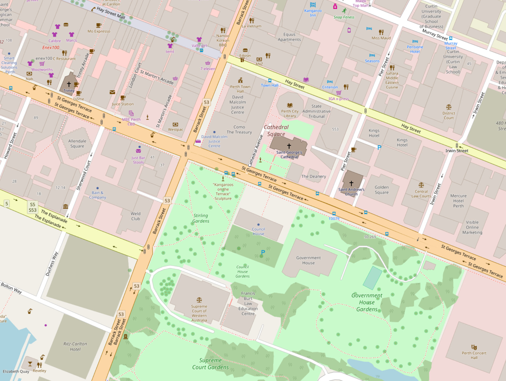
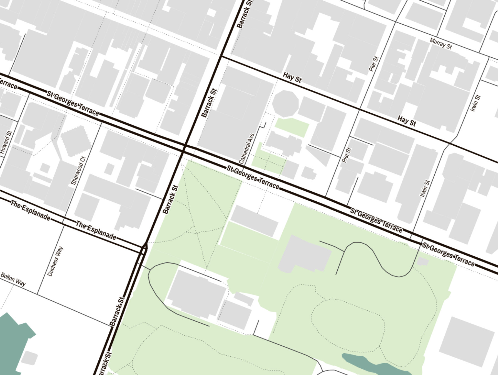
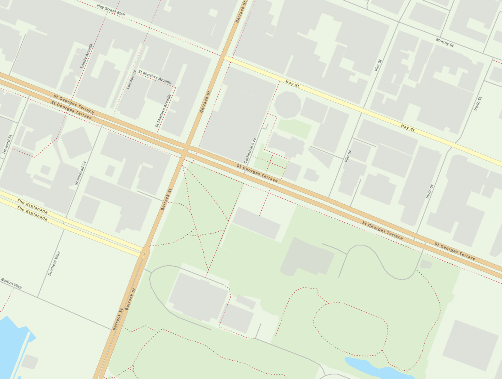

# EAlGIS


# Build status

[](https://travis-ci.org/ealgis/ealgis)

# Interactive Data Analysis

EAlGIS offers:

-   a web interface to allow quick, interactive analysis of geospatial data, overlaid over a Google baselayer using OpenLayers
    -   add one or more "polygon" layers, which plot a given loaded polygon data source (PostGIS table)
    -   polygons in the layer are filled according to a function, which uses attributes that are linked to the chosen geometry
        functions are simple expressions. to plot the percentage of women in each Australian Census SA1 polygon, you would enter
        the formula "100 \* B2 / B3". this is automatically resolved into a database query which can be called by MapServer
    -   polygons can also be filtered out. For example, if you wish to avoid SA1s which have very few people (and thus may have
        nonsense values when percentages of some attribute are calculated), you might add a filter "b3 > 30" when plotting the
        Australian Census.
    -   download calculated values for further analysis
    -   user access delegated to Mozilla Personas
-   reproducable data loader infrastructure, and pre-supplied loader for the Australian Census 2011.
    -   be sure where the data in your database came from
    -   automated reprojection to map SRIDs (a big performance win)
    -   includes loaders for shapefiles, and for CSV data (which can be linked with shapefiles, for easy interactive analysis)
-   framework for off-line analysis work
    -   perform complex analysis outside of EAlGIS, and then load the results in to visualise them on a map

# Installation

EAlGIS is intended to be run within docker.

To get started:

> docker-compose up

# Django Setup

Add a [Python Social Auth](http://python-social-auth.readthedocs.io/en/latest) backend of your choice. e.g. [Social backends](http://python-social-auth.readthedocs.io/en/latest/backends/index.html#social-backends).

Assuming you're configuring Google as a backend for auth:

Refer to [PySocialAuth Google](http://python-social-auth.readthedocs.io/en/latest/backends/google.html) and [Google - Using OAuth 2.0 to Access Google APIs](https://developers.google.com/identity/protocols/OAuth2?csw=1#Registering).

-   Create a Web application OAuth 2 Client in the Google API's Console
    -   Add `http://localhost:8000` as an **Authorised JavaScript origin**
    -   Add `http://localhost:8000/complete/google-oauth2/` as an **Authorised redirect URI**
    -   Enable the Google+ API
-   Copy `django/web-variables.env.tmpl` to `django/web-varibles.env`
-   Add the resulting Client Id and Secret to `django/web-variables.env`
-   Nuke and restart your Docker containers
-   Navigate to `http://localhost:8000/`, choose Google as your signon option, and you should be sent through the Google OAuth flow and end up back at `http://localhost:8000/` with your username displayed on the app.

Now you're up and running!

# Becoming An Admin

Making yourself an admin:

Hop into your running `ealgis_web` Docker container:

`docker exec -i -t ealgis_web_1 /bin/bash`

And enter the Django Admin shell:

```
django-admin shell
from django.contrib.auth.models import User
User.objects.all()
user=_[0]
user.is_staff = True
user.is_superuser = True
user.save()
user.profile.is_approved = True
user.profile.save()
```

Now you should be able to navigate to the Django admin backend at `http://localhost:8000/admin/`!

# Choosing a basemap

EALGIS supports a choice of four basemap providers that can be configured via environment variables in `docker-compose.yml`.

<table>
    <tr>
        <td><strong>Provider</strong></td>
        <td><strong>Basemap Style</strong></td>
    </tr>
    <tr>
        <td><a href="https://www.mapbox.com">Mapbox Light</a><br />Free for personal use.<br />Charges for private or commercial use.</td>
        <td></td>
    </tr>
    <tr>
        <td><a href="https://operations.osmfoundation.org/policies/tiles/">OpenStreetMap</a><br />Free use with some <a href="https://operations.osmfoundation.org/policies/tiles/">limitations</a>.</td>
        <td></td>
    </tr>
    <tr>
        <td><a href="http://maps.stamen.com/#toner/">Stamen Maps</a><br />Free and Creative Commons Attribution licensed. </td>
        <td></td>
    </tr>
    <tr>
        <td><a href="https://thunderforest.com">Thunderforest</a><br />Free below 150,000 tiles/month.</td>
        <td><br /></td>
    </tr>
</table>

# Get some data

However, you won't have any data. You'll need to load one or more datasets into EAlGIS.
You may wish to start with the 2011 Australian Census: https://github.com/grahame/ealgis-aus-census-2011

When loading data, you might want to clone the loader module in the `data/uwsgi` directory
of the EAlGIS checkout. The code will then be available in `/data` in your
uwsgi container.

# Development

## Dump and restore Docker images

From time to time you made need to nuke your Docker images and start again in order to free up disk space. This appears to occur due to Docker's handling of its shared disk image - at least on macOS - and its inability to free up disk space when containers are removed.

To work around this we need to save our Docker images (to avoid the need to rebuild them), reset Docker, and then reload and tag our images.

1.  Save all of your Docker images to a `.tar` file:

```
docker save $(docker images -q) -o mydockerimages.tar
```

2.  Save the tags used to describe each image:

```
docker images | sed '1d' | awk '{print $1 " " $2 " " $3}' > mydockerimages.list
```

3.  Nuke your Docker disk image `Docker > Preferences > Reset > Remove all data`

4.  With your freshly reset Docker, reload your images:

```
docker load -i mydockerimages.tar
```

5.  And tag the imported images:

```
while read REPOSITORY TAG IMAGE_ID
do
  echo "== Tagging $REPOSITORY $TAG $IMAGE_ID =="
  docker tag "$IMAGE_ID" "$REPOSITORY:$TAG"
done < mydockerimages.list
```

Steps courtesy of [https://stackoverflow.com/a/37650072](https://stackoverflow.com/a/37650072).
