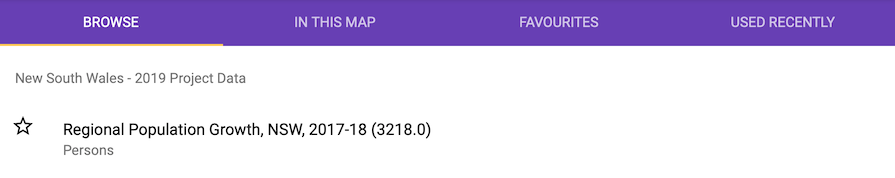
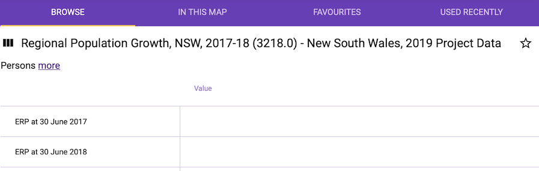

# EALGIS - Generic CSV Loader

Got some data in CSV files you want to load into your EALGIS install? Well you've come to the right place!

To follow this guide you'll need two things:

1. Some spatial data (Covered under `Load the relevant geographic areas` below.)
2. Some CSV formatted data (Covered under `Creating the config file for your data` below.)

**Tip:** We're going to talk a lot about "schemas" in this guide. In a technical sense, these are literally PostgreSQL database schemas. In a practical sense, they're containers for grouping together one or more datasets. e.g. The `ABS Census 2016 - General Community Profile` data probably lives in a schema called `aus_census_2016_gcp`.

At the end of this process you'll have a PostgreSQL `.dump` file containing a schema with your dataset(s) that you can load into your EALGIS install. This file is intended to **completely** replace the existing schema.

Since you'll likely have multiple datasets in one schema we recommend keeping the CSV and JSON files for each schema in a structure like so:

```
config/
    schema_name/
        dataset_a/
            dataset_a.csv
            dataset_a.json
        dataset_b_/
            dataset_b_.csv
            dataset_b_.json
        ...
```

Should you then ever need to create the schema from scratch, it's then just a matter of running `load.sh` against each of the JSON files in turn.

## 0. Prerequisites

-   [Docker Desktop](https://www.docker.com/products/docker-desktop)
-   [Docker Compose](https://docs.docker.com/compose/install/)
-   [PostgreSQL's Command-line tools](https://www.ibm.com/cloud/blog/new-builders/postgresql-tips-installing-the-postgresql-client)
-   [An EALGIS install](https://github.com/ealgis/ealgis/)

## 1. Initialise the database

But before you start any of that you need to initialise the standalone database that this CSV loader will use to temporarily store your data. Simply run:

```
docker-compose up datastore
```

And if all goes well will the log will end with:

```
LOG:  database system is ready to accept connections
```

You can verify this by connecting to the database on `localhost` (username/password: `postgres/postgres`) and looking at the database called `ealgis`. At this stage it should be populated with the default `public` schema, and the three special schemas that come with PostGIS by default:

```
    List of schemas
    Name    |  Owner
------------+----------
 public     | postgres
 tiger      | postgres
 tiger_data | postgres
 topology   | postgres
(4 rows)
```

You can now exit and shutdown the datastore Docker container (`docker-compose stop datastore`).

## 2. Load the relevant geographic areas

Next up you'll need to load in the spatial data that will provide the link between your CSV and seeing your data on a map.

This will be the same data that you've already got loaded in your EALGIS install, but for the purposes of this loader we also need a copy in the loader's database. (For Census data, it's found in schemas like `aus_census_2016_shapes`.)

### Getting spatial data

If you're working with data using ABS geographic areas or electoral boundaries, then you can simply download the relevant PostgreSQL dump files from our [postgresql_dumps](https://github.com/ealgis/postgresql_dumps) repo.

**Tip:** If you'd like to run the data loaders yourself the postgresql_dumps repo has links to our collection of data loaders.

#### Your own custom data

If you're working with your own custom data, then you'll need to use `pg_dump` to dump out your spatial data schema.

### Loading spatial data

Wherever you got your data from, drop the `.dump` somewhere in this repo and run:

```
docker-compose run dataloader /bin/bash
```

Once inside the dataloader container you can `pg_restore` your dump file.

### Restoring the whole schema

It's usually best to restore the whole schema (even if that can take quite a while). For example:

```
pg_restore --host=datastore --username=postgres --dbname=ealgis /app/aus_census_2016_shapes.dump
```

### Selectively restoring the schema

**Caveat emptor: This process may change with future versions of EALGIS and may break in fun and interesting ways.**

But if you really want to, you can restore only the geometry tables that are relevant to the CSV files that will be in the schema created by this loader.

In this case, let's load data from the `sa2` table:

```
pg_restore --host=datastore --username=postgres --dbname=ealgis --schema-only /app/aus_census_2016_shapes.dump
pg_restore --host=datastore --username=postgres --dbname=ealgis --data-only --table=table_info /app/aus_census_2016_shapes.dump
pg_restore --host=datastore --username=postgres --dbname=ealgis --data-only --table=ealgis_metadata /app/aus_census_2016_shapes.dump
pg_restore --host=datastore --username=postgres --dbname=ealgis --data-only --table=column_info /app/aus_census_2016_shapes.dump
pg_restore --host=datastore --username=postgres --dbname=ealgis --data-only --table=geometry_source /app/aus_census_2016_shapes.dump
pg_restore --host=datastore --username=postgres --dbname=ealgis --data-only --table=geometry_source_projection /app/aus_census_2016_shapes.dump
pg_restore --host=datastore --username=postgres --dbname=ealgis --data-only --table=sa2 /app/aus_census_2016_shapes.dump
```

## 3. Creating the config file for your data

Now we can move on to the main event: Writing the JSON file that describes our data!

Check out the `config/sample/` directory in this repo for an example CSV and JSON file based on the [2017-18 Regional Population Growth](https://www.abs.gov.au/AUSSTATS/abs@.nsf/Lookup/3218.0Main+Features12017-18?OpenDocument) data for NSW from the ABS. All of the documentation and examples from here on are based on this dataset and should be read alongside the sample files provided.

Each CSV dataset that you want to load into a schema will needs its own JSON file.

### Data

| Attribute     | Description                                                                                                                |          |
| ------------- | -------------------------------------------------------------------------------------------------------------------------- | -------- |
| type          | Possible values: `csv`                                                                                                     | Required |
| file          | The name of the file containing the data. Relative to the location of your JSON config file.                               | Required |
| db_table_name | The name of the database table that will be created for this dataset. May not contain invalid characters like `.` and `-`. | Required |
| csv           | A JSON object with directives that control how the CSV file will be processed. See `CSV Options` below.                    | Required |

#### CSV Options

**Important:** CSV column names must be unique within each schema. i.e. Two datasets in the same schema can't use the same column name.

**Note:** All CSV column names will be converted to lower case during the ingest process.

| Attribute | Description                                                              |                                                              |
| --------- | ------------------------------------------------------------------------ | ------------------------------------------------------------ |
| dialect   | From [csv.reader](https://docs.python.org/3/library/csv.html#csv.reader) | Optional. Defaults to `excel`.                               |
| encoding  | The character encoding of the CSV file.                                  | Optional. Defaults to `utf-8-sig`.                           |
| skip      | How many lines to skip.                                                  | Required. Set to 0 if not applicable. (This makes no sense.) |

### Schema

**Note:** If you've already run this CSV loader and created a schema then you only need to provide the `name` attribute.

| Attribute      | Description                                                                |                                                                                        |
| -------------- | -------------------------------------------------------------------------- | -------------------------------------------------------------------------------------- |
| name           | The name of the schema that the dataset will be loaded into. e.g. `sample` | Required. Must be a valid PostgreSQL schema name.                                      |
| title          | The title of the schema has users will see it. e.g. `2019 Project Data`    | Optional - only needed if the schema doesn't exist.                                    |
| description    | A description for the schema.                                              | Optional - only needed if the schema doesn't exist.                                    |
| date_published | When the schema was published. e.g. `2019-03-27`                           | Optional - only needed if the schema doesn't exist. Must be formatted as `YYYY-MM-DD`. |


### Geometry Linkage

| Attribute    | Description                                                                                                     |                                  |
| ------------ | --------------------------------------------------------------------------------------------------------------- | -------------------------------- |
| shape_schema | The name of the database schema that contains the geometry for this dataset. e.g. `aus_census_2016_shape`       | Required                         |
| shape_table  | The name of the database table that contains the geometry for this dataset. e.g. `sa2`                          | Required                         |
| shape_column | The name of the column in `shape_table` that contains the ids for the geometry in this dataset. e.g. `sa2_main` | Required                         |
| csv_column   | The name of the column in the CSV file that contains the ids for the geometry. e.g. `sa2_main`                  | Required                         |
| match        | The method used for comparing `csv_column` and `shape_column`.                                                  | Required. Possible values: `str` |

### Metadata

| Attribute       | Description                                                                                                    |          |
| --------------- | -------------------------------------------------------------------------------------------------------------- | -------- |
| collection_name | The name of the collection of datasets this data will be grouped with. e.g. `New South Wales`                  | Required |
| title           | A name of the dataset that users will see in the data browser. e.g. `Regional Population Growth, NSW, 2017-18` | Required |
| description     | A description for this dataset that users will see in the data browser.                                        | Required |
| kind            | The sub-title for this dataset. Usually, the population/thing the data is describing. e.g. `Persons`           | Required |
| family          | A short identifier/acronym/product code for this dataset. e.g. `3218.0`                                        | Required |



### Column Metadata

An optional JSON object that provides human-readable titles for the column names in the CSV.

For example:

```json
"column_metadata": {
    "erp_30_june_2017": "ERP at 30 June 2017",
    "erp_30_june_2018": "ERP at 30 June 2018"
}
```



## 4. Run the data loader

Now that you've described how your data should be processed we can run the loader!

```
docker-compose run dataloader /bin/bash
./load.sh /app/config/sample/config.json
```

The output should look something like this:

```
2019-08-18 10:07:36,403 [INFO   ] [MainThread]  create schema: sample
2019-08-18 10:07:38,443 [INFO   ] [MainThread]  dumping database: /app/dump/sample.dump
2019-08-18 10:07:38,757 [INFO   ] [MainThread]  successfully dumped database to /app/dump/sample.dump
2019-08-18 10:07:38,760 [INFO   ] [MainThread]  load with: pg_restore --username=user --dbname=db /path/to/sample
2019-08-18 10:07:38,763 [INFO   ] [MainThread]  then run VACUUM ANALYZE;
```

## 5. Loading the data into EALGIS

Drop your `.dump` file in the `loaders` directory of your EALGIS install. If necessary, add the `loaders` directory to the `datastore` container in your `docker-compose.yml` file:

```yaml
volumes:
    - ./loaders:/app
```

**Note:** The `.dump` file created by this loader is intended to completely replace the existing schema in your EALGIS install. So remember to `DROP SCHEMA schema_name CASCADE;` before trying to `pg_restore` this schema.

```
docker exec -it ealgis_datastore_1 sh
pg_restore --host=localhost --username=postgres --dbname=datastore /app/sample.dump
```

As your last steps:

1. Run `VACUUM ANALYZE;`
2. Restart your EALGIS `web` container so it picks up the newly refreshed schema

And you're done!

# Maintenance

## Updating docker-ingest-base

If we release a new version of the `ealgis/ingest-base` Docker image used for `dataloader`, execute these commands to pull in a new version.

```
docker-compose rm dataloader
docker image rm ealgis/ingest-base:latest
docker-compose pull dataloader
```
